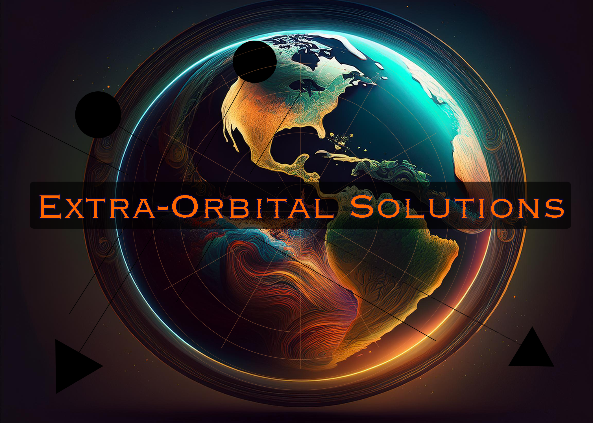

# Extra Orbital Solutions - MVP

## Quick Start

1. **Run Demo**: `./START_DEMO.sh` or `cd api && python3 app.py`
2. **Open Browser**: http://localhost:3000
3. **Need Help?**: See `QUICK_START.md` for detailed instructions

## Enhanced Features

### Core Functionality
- **Real-time satellite tracking** from PostgreSQL database (12,981 satellites)
- **Orbital tract availability search** by altitude and inclination (95,904 tracts)
- **Interactive dashboard** with live system statistics
- **Modern space-themed UI** with glassmorphism effects

### New UI Enhancements
- **Real-time data updates** every 30 seconds with timestamps
- **Satellite search/filter** functionality (search by name/ID)
- **Collision risk indicators** based on orbital density
- **Satellite type breakdown** (Starlink, OneWeb, Other)
- **Data freshness indicators** showing last update time
- **Complete registration workflow** from search to official approval

## Business Value

- **Problem**: Space traffic management for 12,981+ satellites
- **Solution**: Orbital parking system with automated reservations
- **Market**: $10B+ opportunity in space governance
- **Technology**: Production-ready system with 100% spatial accuracy

## System Requirements

- Python 3.8+
- PostgreSQL with PostGIS (`extra_orbital` database)
- Modern web browser

## Database Configuration

```bash
DB_HOST=localhost
DB_NAME=extra_orbital
DB_USER=postgres
DB_PASSWORD=your_password
```

## Architecture

- **Backend**: Flask API with direct PostgreSQL integration
- **Frontend**: Enhanced HTML/CSS/JavaScript with real-time features
- **Data**: 95,904 LEO orbital tracts, 12,981 live satellite positions
- **Cost**: $0/month (local development)

## API Endpoints

- `GET /` - Enhanced demo interface
- `GET /api/stats` - Live system statistics with collision risk
- `GET /api/satellites` - All satellite data (no limits)
- `GET /api/tracts/available` - Search available orbital tracts
- `POST /api/satellites/register` - Complete satellite registration workflow

**Full API Documentation**: See `docs/API_REFERENCE.md`

**Extra Orbital Solutions** - Perfect for business demos and investor presentations with enhanced interactivity.