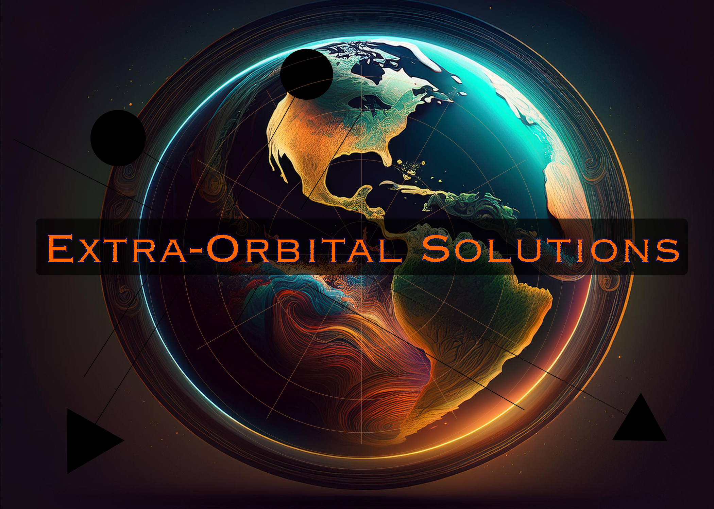

# Extra Orbital Solutions - Brand Assets

## Logo Usage

### Primary Logo
- **File**: `logo.png`
- **Usage**: Main branding, headers, presentations
- **Background**: Works on dark backgrounds
- **Colors**: Orange/teal gradient with Earth imagery

### Logo Guidelines
- **Minimum size**: 100px height for web
- **Clear space**: Maintain 20px padding around logo
- **Background**: Best on dark backgrounds (space theme)
- **Scaling**: Maintain aspect ratio, do not stretch

## Brand Colors
- **Primary Orange**: #FF6B35 (from logo)
- **Primary Teal**: #06B6D4 (from logo)
- **Background Dark**: #0F172A
- **Text Light**: #E2E8F0

## Typography
- **Primary**: Inter (web interface)
- **Logo**: Custom typography in logo image

## Usage Examples
- ✅ Web headers and navigation
- ✅ Business presentations
- ✅ Documentation and reports
- ✅ Social media profiles
- ✅ Email signatures

## File Locations
- **Web**: `frontend/static/assets/logo.png`
- **Blog**: `blog/assets/logo.png`
- **Docs**: `docs/logo.png`

## Brand Message
"Extra Orbital Solutions - Transforming Space Traffic Management"

Professional space technology company focused on orbital governance and satellite traffic management.